# Package of the Day 📦

&nbsp;&nbsp;
&nbsp;&nbsp;
<a href="https://choosealicense.com/licenses/mit/" target="_blank"></a>&nbsp;&nbsp;
&nbsp;&nbsp;


A Flutter practice project focused on mastering popular packages through hands-on implementation and real-world UI examples.

This project is built to strengthen Flutter development skills by exploring one package at a time with practical, working code samples.

---

## 📖 About the Project

**Package of the Day** is a learning-focused Flutter project where essential and advanced packages are explored through practical implementations.  
Instead of just reading documentation, this project focuses on *learning by building*.

The goal is to understand how Flutter packages work, when to use them, and how to integrate them effectively into real applications.

🎯 Perfect for:
- Flutter developers learning new packages
- Quick reference for package implementation
- Hands-on practice with popular pub.dev packages
- Building a personal package knowledge library

---

## 📦 Packages Covered

### Day 01. Avatar Glow
- Animated glowing ring effect around widgets
- Perfect for profile pictures & live indicators
- Call buttons and active status badges
- Package: `avatar_glow: ^3.0.1`
- Features: Customizable glow color, duration, and repeat patterns

### Day 02. Google Fonts
- Instant access to 1500+ fonts from [fonts.google.com](https://fonts.google.com) — no manual downloads, no pubspec asset setup
- Great for fast typography experiments, branding, and UI polish
- Includes a **live preview** with an interactive font-size slider and bold toggle, so anyone opening the app can see the effect of typography changes in real time
- Package: `google_fonts: ^8.2.0`
- Features: custom font weight, style, and size support; caches fonts locally after first load for offline use

### Day 03. Liquid Pull to Refresh
- Replaces the default refresh spinner with a fun, animated **liquid-fill** effect
- Great for adding personality to list-based screens (feeds, dashboards, inboxes)
- Includes a **live refresh counter** and **last-refreshed timestamp**, so the effect of pulling to refresh is visible, not just decorative
- Package: `liquid_pull_to_refresh: ^3.0.1`
- Features: customizable liquid color, background color, height, and animation speed

### Day 04. Percent Indicator
- Animated **circular** and **linear** progress indicators for stats, downloads, and onboarding screens
- Includes a **live, draggable slider** that updates the circular indicator in real time — not just a static hardcoded percentage
- A "Quick Stats" section shows several linear bars at once (storage, battery, downloads), styled as clean white cards
- Package: `percent_indicator: ^4.2.5`
- Features: customizable stroke width, colors, rounded caps, and animation duration for both indicator types

### Day 05. Carousel Slider
- Fun, built-in **3D cube transition** between slides, plus a circular slide indicator — no custom animation code needed
- Carousel is sized as a **fixed-height banner (220px)**, not stretched full-screen — mirrors how carousels actually appear in real apps (App Store featured banners, onboarding hero sections)
- A "Why use it" section below the banner fills out the rest of the screen with real content, so the layout looks like a finished screen rather than an isolated widget demo
- Each slide is a styled gradient card with an icon, title, and subtitle instead of a flat color block
- Package: `flutter_carousel_slider: ^1.1.0`
- Features: swappable slide transforms (e.g. cube), customizable slide indicators, infinite looping via `unlimitedMode`

### Day 06. Smooth Page Indicator
- Pairs with any PageView to add polished, animated dot indicators — a staple of onboarding flows
- Page view is sized reasonably within the layout (not a nested Scaffold per page, not full-screen by accident), with a "Next" button that walks through pages using the shared PageController
- Each page is a gradient card with an icon, title, and subtitle instead of an empty colored box, and the button label changes to "You're all set" on the last page
- Package: smooth_page_indicator: ^2.0.1
- Features: multiple built-in dot effects (ExpandingDotsEffect, WormEffect, JumpingDotEffect, and more), fully customizable size, spacing, and color

### Day 07. Font Awesome
- Brings 2000+ Font Awesome icons (solid, regular, and brand) to Flutter as simple `FaIcon` widgets — a drop-in replacement for the standard `Icon`
- A clean grid showcases a mix of brand icons (GitHub, Google, LinkedIn) and common UI icons (bell, heart, star, search), each in its own labeled card
- Package: `font_awesome_flutter: ^11.0.0`
- Features: solid/regular/brand icon sets, same API as Flutter's built-in `Icon` widget

### Day 08. Animations (OpenContainer)
- OpenContainer (from the animations package) smoothly morphs a small card into a full detail screen — a common pattern in real apps (product cards, list-to-detail navigation)
- Uses a realistic example: a short list of trail cards that expand into detail pages with a title, tag, and description, instead of an abstract "small box / big box" demo
- Package: animations: ^2.2.0
- Features: multiple transition types (fadeThrough, fade, fadeThroughWithRipple), customizable colors, shapes, and duration for both the closed and open states

### Day 09. Neon
- Renders glowing, sign-style text with built-in retro fonts (Cyberpunk, Night Club 70s, Beon, and more), colors, and an optional flicker effect
- Kept on a dark background intentionally — unlike the earlier light-themed days, neon glow only reads clearly against black, so each sign sits in its own subtly-bordered panel like a real sign board
- Package: neon: ^0.1.0
- Features: multiple neon fonts, custom glow color, adjustable font size, per-letter or whole-text flickering

### Day 10. Aurora Gradients
- Draws soft, blurred color blobs to give a screen an ambient, animated backdrop
- Kept on a black background intentionally, same reasoning as Day 09 — the glow only reads clearly against dark backdrops
- Content sits on a frosted-glass card (BackdropFilter + translucent container) over the aurora blobs, showing a realistic use case — a hero/landing header — rather than plain text floating on the background
- Package: aurora: ^1.0.0
- Features: customizable blob size, position, and color list; layer multiple Aurora widgets in a Stack for a fuller effect

### Day 11. Card Swiper
- Turns a list of widgets into an auto-playing, swipeable carousel with pagination dots — a common pattern for promo/banner sections
- The original example used bundled asset images (assets/images/banner/*.jpg); swapped for styled gradient banner cards (icon, title, subtitle) so the example runs standalone without needing image assets in the project
- Carousel is sized as a fixed 190px banner, not full-screen, sitting inside a scrollable page alongside the info card
- Package: card_swiper: ^3.0.1
- Features: autoplay with configurable delay, multiple layouts, customizable pagination dot builder

### Day 12. BlurHash
- Decodes a short string (like LB9amjso4Txuq@t8yYMxD4IUysx]) into a soft blurred preview shown instantly, while the real image loads over the network — the same technique behind Medium's and Wolt's image placeholders
- Added a "Replay transition" button so you can watch the blur-to-image fade more than once, instead of only seeing it on first load
- Generate your own hash for any photo at blurha.sh
- Package: flutter_blurhash: ^0.9.1
- Features: works as an Image fit/loader combo, configurable fade duration, any BoxFit

### Day 13. Flutter SVG
- Renders vector graphics via SvgPicture.asset, .network, or .string — stays crisp at any size, unlike raster (PNG/JPG) images
- The original example loaded a bundled asset (assets/svg/flutter.svg); since that file isn't available here, this uses inline SVG strings with SvgPicture.string instead, so the example runs standalone with no asset setup — swap in SvgPicture.asset(...) once you have real files in pubspec.yaml
- A small gallery shows three hand-written vector icons (sun, mountains, rocket) in styled cards
- Package: flutter_svg: ^2.3.0
- Features: BoxFit support, works from assets, network URLs, or raw SVG strings

### Day 14. Custom Clippers
- Ships ready-made ClipPath shapes — waves, arcs, tickets, diagonals — for headers, banners, and cards without hand-drawing paths yourself
- Rather than dumping all ~18 clippers with debug labels, this curates 4 clippers used the way they'd appear in a real app: a wave header banner, a movie-ticket-style coupon card, an arc promo banner, and an oval profile header
- Each shape is filled with a gradient and real content (icon + text) instead of a flat color with the class name printed on it
- Package: flutter_custom_clippers: ^2.1.0
- Features: wave, arc, oval, diagonal, ticket, and pointed-edge clippers, most with flip/reverse options for mirroring

### Day 15. Flutter TTS
- Converts text into spoken audio using the platform's built-in speech engine — no server, API key, or internet connection required
- Swapped the original's unrelated news-article sample text for generic, self-describing copy ("try adjusting the rate and pitch...") so the demo makes sense on its own
- Added live speech-rate and pitch sliders wired directly to setSpeechRate / setPitch, so you can actually hear the effect instead of only seeing fixed platform-specific presets
- Package: flutter_tts: ^4.2.5
- Features: adjustable language, pitch, speech rate, and volume; start/completion/cancel handlers to track playback state

### Day 16. Flutter Highlight
- Adds syntax-colored code blocks with themes borrowed from highlight.js — handy for tutorials, docs, and code-sharing screens
- Fixed a bug from the original: the code was Dart but language was set to 'javascript' — now correctly matches each snippet's actual language
- A small language switcher (Dart / JSON) swaps both the code and the highlighter's language live, and a copy button puts the current snippet on the clipboard with a confirmation snackbar
- Package: flutter_highlight: ^0.7.0
- Features: dozens of built-in themes, language auto-detection or explicit language param, works with any TextStyle (paired here with google_fonts' Fira Code for a real code-editor look)

### Day 17. Syncfusion Flutter Charts
- Production-ready bar, line, and area/pie charts with built-in tooltips, legends, and animation — free for individuals and small businesses under Syncfusion's Community License
- The original referenced RunningBidsChart, CompletedBidsChart, and TotalAmountChart from a separate model.dart that wasn't included; this version is fully self-contained with sample weekly data built right in, so it compiles and runs standalone
- Three chart types on purpose, to show range: a column chart (running bids), a line chart with markers (completed bids), and an area chart (total amount)
- Package: syncfusion_flutter_charts: ^34.1.32
- Features: TooltipBehavior, category/numeric axes, dozens of series types (column, line, area, pie, and more), per-series color and styling

### Day 18. RFlutter Alert
- Makes it easy to show styled dialogs — success, error, warning, and fully custom layouts — with built-in animations
- The six examples are laid out as a **clean tappable action list** (icon, title, subtitle) instead of six stacked `ElevatedButton`s with plain labels
- The original loaded a bundled asset image for the "custom image" example; swapped for an `Icon` widget instead, showing that the `image:` slot accepts any widget, not just `Image.asset` — so it runs standalone with no asset setup
- Package: `rflutter_alert: ^2.0.7`
- Features: built-in alert types (success, error, warning, info), custom buttons with color/gradient, fully custom `AlertStyle` (animation, border, colors), and arbitrary custom `content`

### Day 19. Settings UI
- Builds native-feeling settings screens — sections, tiles, and switches — without hand-rolling ListTile styling and dividers yourself
- Fixed a logic bug from the original: "Change password" was a switchTile (a boolean toggle), which doesn't make sense for an action like changing a password — it's now a regular tappable tile like "Sign out" or "Email"
- Every tile's onPressed now shows a snackbar (Opening "Language"...) instead of doing nothing, so tapping around actually gives feedback
- Package: flutter_settings_ui: ^3.0.1
- Features: sections with titles, standard tiles, switch tiles, custom leading/trailing widgets, works with Text widgets for full styling control

### Day 20. Flutter Spinkit
- Ships 20+ animated loading indicators — a drop-in upgrade from the default CircularProgressIndicator
- Curated down to 9 spinners in one consistent accent color, instead of all 20+ in random colors separated by thick dividers — easier to compare styles side by side, and reads as a designed screen rather than a raw feature dump
- Added an "In Practice" section: a real submit button that swaps its label for a spinner during a simulated 2-second load, showing the pattern you'd actually use in an app
- Package: flutter_spinkit: ^5.2.2
- Features: dozens of spinner styles, customizable color, size, duration, and (for some) control via AnimationController

### Day 21. Audioplayers
- Plays audio from assets, files, or URLs, with play/pause/seek control and position/duration streams
- Updated to the current API — the original used AudioCache and PlayerMode.LOW_LATENCY, which are from a much older version of the package (pre-v1). audioplayers: ^6.8.1 plays sources directly via AudioPlayer().play(...) with typed sources like UrlSource, AssetSource, or DeviceFileSource
- Also replaced missing local assets (audio file + cover image) with a streamed sample track from a public URL and a gradient album-art placeholder, so the example runs standalone
- Added a live, seekable progress bar driven by onPositionChanged/onDurationChanged, and pause/resume instead of only play/stop
- Package: audioplayers: ^6.7.1
- Features: multiple source types, player state stream, position/duration streams, seeking

### Day 22. Go Router
- Adds declarative, URL-based navigation to Flutter — deep linking and browser back/forward work out of the box, on web and mobile alike
- Updated to the current router API: replaced the separate routeInformationParser / routerDelegate parameters with the single routerConfig parameter, which is what go_router (and Flutter's Router widget) recommends as of v6+
- Renamed Page1Screen/Page2Screen to HomeScreen/DetailsScreen, each showing its current path so it's clear what context.go(...) actually changed
- Package: go_router: ^17.3.0
- Features: declarative route definitions, path parameters, nested/shell routes, redirects, deep linking

### Day 23. HTTP
- Makes GET, POST, and other requests with a simple, promise-like API — this example fetches a sample record from a free public test API (jsonplaceholder.typicode.com)
- Fixed a race condition in the original: it set isLoading = false after a hardcoded 3-second Future.delayed, regardless of whether the actual request had finished — meaning a slow network would flip the UI back before data arrived, and a fast one would show a spinner for 3 seconds for nothing. Now the button awaits _fetchData() directly, and loading state is always cleared in a finally block
- Added proper error handling — failed requests now show a visible error message instead of just a print() no one sees
- JSON response is pretty-printed (JsonEncoder.withIndent) in a code-style block, instead of dumped as one unformatted line of text
- Package: http: ^1.6.0
- Features: GET/POST/PUT/DELETE, headers, timeouts, works with any REST API

### Day 24. Onboarding
- Drag-based onboarding flow with a fixed footer, page indicator, and skip/get-started button — built on the verified v4.0.2 API
- Each slide's icon sits in a gradient circle with a soft shadow instead of a flat tinted circle — small touch, reads noticeably more polished
- Package: onboarding: ^4.0.2
- Features: CustomPainter-based indicators (4 built-ins: LinePainter, CirclePainter, SquarePainter, TrianglePainter), fully custom footer builder, configurable animation speed

### Day 25. Flutter Neumorphic
- Renders "soft UI" components — embossed buttons, sliders, switches, progress bars — using light/shadow pairs instead of flat colors or borders
- Trimmed down to 4 core components (progress, button, slider, switch) instead of the full showcase (radio, checkboxes, 8 indicators, two button styles) — easier to read top to bottom and enough to show the visual style clearly
- Uses the package's own theming (NeumorphicTheme/NeumorphicBackground) rather than the series' usual white-card style, since neumorphism needs one shared flat base color for the embossed effect to read correctly
- Working dark/light toggle in the header, now a single icon button instead of a labeled "Dark Mode" button
- Switched to flutter_neumorphic_plus — the original flutter_neumorphic package is unmaintained and its source still references Flutter Material APIs (bodyText2, headline5, ThemeData.accentColor, AppBarTheme.textTheme) that were removed in later Flutter SDK versions, causing build failures. The fork patches exactly this and is a drop-in replacement — same widget names, same API, just a different import path (package:flutter_neumorphic_plus/flutter_neumorphic.dart)
- Package: flutter_neumorphic_plus: ^3.5.0
- Features: NeumorphicButton, Slider, Switch, Progress, concave/convex/flat shape styles, full dark mode support

### Day 26. Math Expressions
- Parses and evaluates math strings like `"1+2-4*3"` at runtime — handy for calculators, spreadsheets, or user-defined formulas
- **Fixed a crash bug**: the original called `exp.evaluate(...)` with no error handling — typing anything malformed (`"2+"`, `"2++2"`, empty input) would throw an uncaught exception and crash the widget. Wrapped in a `try/catch` that shows a friendly "Invalid expression" message instead
- **Fixed a confusing UX bug**: the original's "Clear" button only reset the *answer* text while leaving stale text in the input field — now "Reset" clears both together
- Added **quick-insert operator buttons** (`+ − × ÷ ( ) .`) that type into the field at the cursor position, since typing math symbols on a phone keyboard is annoying
- Package: `math_expressions: ^3.1.0`
- Features: `Parser`/`Expression`/`ContextModel` for parsing and evaluating arbitrary math strings, supports variables, functions, and multiple evaluation types

### Day 27. Clay Containers
- Renders soft, moldable "clay" shapes using layered shadows — flat, embossed, concave, or convex — all derived from one base color
- **Kept a single flat base color throughout the screen**, same reasoning as Day 25's neumorphic example: clay/soft-UI effects only render correctly when every element shares the same background color, so the series' usual white-card style would fight the effect here
- Replaced the original's **10 unlabeled shapes stacked in a column** with three organized sections: a realistic "profile card" combining `ClayContainer` + `ClayText`, a labeled side-by-side comparison of the three curve types, and a small custom-border-radius gallery
- Package: `clay_containers: ^0.3.4`
- Features: `ClayContainer` (flat/emboss, adjustable depth/spread, custom border radius, concave/convex/none curve types), `ClayText` for embossed text

### Day 28. Day/Night Switch
- **`day_night_switcher` (originally requested) is discontinued** — swapped for `day_night_switch`, an actively maintained package offering the same idea (an animated sun/moon toggle), with a simpler single-widget API instead of two separate widgets
- **Removed a redundant UI pattern** from the original: it had three separate controls (`Switch.adaptive`, `DayNightSwitcher`, and `DayNightSwitcherIcon`) all bound to the exact same boolean — visually confusing and pointless, since toggling any one should logically toggle all three. Now there's a single switch
- Uses `provider`'s `ChangeNotifier` to drive `ThemeMode` across the whole app — the switch is just one input that calls `toggleTheme()`; everything else (app bar colors, background, text colors) updates automatically via `Theme.of(context)`
- Package: `day_night_switch: <latest>` (replacing discontinued `day_night_switcher: ^0.2.0+1`)
- Features: single animated toggle between day/night states, customizable day/night/sun/moon colors, optional custom sun/moon images

### Day 29. Provider
- Lightweight state management built on `InheritedWidget` — `ChangeNotifier` + `context.watch`/`context.read` instead of manually threading callbacks through widget constructors
- **Kept the original's smart pattern of isolating the watching widget**: only `_CountDisplay` calls `context.watch<Counter>()`, so incrementing/decrementing only rebuilds that one `Text`, not the whole screen — this was correctly commented in your original code and preserved here
- **Replaced the three stacked `FloatingActionButton`s** (unconventional — Material design expects a single FAB, not three crammed into a `Row` inside `floatingActionButton`) with a proper inline button row: minus / restart (outlined) and plus (filled, as the primary action)
- Package: `provider: ^6.1.5+1`
- Features: `ChangeNotifier`, `ChangeNotifierProvider`, `MultiProvider` for combining multiple providers, `context.watch`/`context.read`/`context.select` for reading state with different rebuild granularity

### Day 30. Flutter Lucide
- Lucide is a free, open-source icon set of 1,699+ simple, consistent outline icons on a 24x24 grid — a clean alternative to Material's filled icon set, and the actively-maintained continuation of the (now-discontinued) Feather icon project
- Curated the original's 20-icon dump across 5 rows in 5 different pastel background colors down to a **labeled 12-icon grid in one consistent accent color**, matching Day 7's Font Awesome showcase
- Package: `flutter_lucide: <latest>`
- Features: 1,699+ icons, tree-shaking (only the icons you actually use are bundled), cross-platform (Android/iOS/web/desktop), regularly updated alongside upstream Lucide releases

### Day 31. Simple Gradient Text
- Paints any string with a linear or radial color gradient — a quick way to make a headline, hero title, or logo text stand out without a custom `ShaderMask`
- A large **hero-style gradient title** up top, plus two labeled example cards below (linear vs. radial), instead of one lone centered example — shows both gradient types side by side for comparison
- Package: `simple_gradient_text: ^1.4.0`
- Features: `GradientType.linear` (default) or `.radial`, any number of colors, adjustable radius for radial gradients, works with any `TextStyle`

### Day 32. Image Picker
- Lets users choose a photo from their gallery or take a new one with the camera — a near-universal building block for profile pictures and uploads
- **Fixed a web-compatibility bug**: the original used `File(image.path)` and `Image.file(...)`. `dart:io`'s `File` doesn't work on Flutter web (there's no real filesystem there) — this would crash if the app ever ran on web. Reads the picked image as bytes (`picked.readAsBytes()`) and displays it with `Image.memory(...)` instead, which works identically on mobile, desktop, and web
- **Fixed silent error handling**: the original only `print()`ed failures — invisible to the actual user. Failures now show a snackbar with the actual error message
- Restyled the preview as a circular avatar placeholder (with a loading spinner while picking) instead of the default `FlutterLogo`, and the two buttons as a labeled icon row instead of full-width stacked buttons
- Package: `image_picker: ^1.2.3`
- Features: pick from gallery or camera, image/video support, quality and size constraints, cross-platform (Android/iOS/web/desktop where supported)

### Day 33. Curved Labeled Navigation Bar
- Animated convex/curved bottom navigation bar with a floating, elevated icon for the active tab — a distinctive alternative to Flutter's flat `BottomNavigationBar`
- **Consolidated 5 nearly-identical page files** (`HomePage`, `DiscoveryPage`, `AddPage`, `MessagePage`, `ProfilePage` — each the exact same layout with a different string) into one reusable `_PageContent` widget driven by a small `_NavDestination` data list
- **Switched to `IndexedStack`** instead of `_pages[_selectIndex]`, so each page's widget state is preserved when switching tabs rather than being rebuilt from scratch every time
- Package: `curved_labeled_navigation_bar: ^2.0.6`
- Features: animated curved tab transition with a raised active icon, per-item icon + label, customizable bar/button colors, gradient support in some fork variants

### Day 34. Intro Slider
- Full-screen onboarding slider with skip/next/done buttons, animated indicator dots, and per-slide gradient backgrounds
- **Rewritten against the current API**, verified directly from the package's GitHub README: `Slide` no longer exists in `intro_slider: ^4.2.5` — slides are now `ContentConfig` objects, and settings that used to be top-level (`colorDot`, `sizeDot`, `typeDotAnimation`, `backgroundColorAllSlides`) moved into grouped `IndicatorConfig` / `NavigationBarConfig` objects
- Replaced the original's local asset images (`pathImage: 'assets/images/intro_slider/*.png'`) with **icons via `centerWidget`** — a `ContentConfig` field that accepts any widget, not just an image path — so it runs standalone with no bundled assets
- Package: `intro_slider: ^4.2.5`
- Features: gradient or image slide backgrounds, custom skip/next/done buttons and styling, configurable indicator (color, size, animation type), swipe-beyond-end detection, custom layouts via `listCustomTabs`

### Day 35. Phosphor Icons
- Phosphor is a flexible, actively maintained icon family with 772+ icons across 6 weight styles (thin, light, regular, bold, fill, duotone) — one of the more comprehensive general-purpose icon sets available for Flutter
- Package: `phosphor_flutter: ^2.1.0`

### Day 36. Flutter Staggered Grid View
- Ships 6 different grid layout delegates in one package: **Staggered** (cell-span based), **Masonry** (Pinterest-style variable-height columns), **Quilted** (repeating tile patterns), **Woven** (alternating large/offset tiles), **Staired** (diagonal step layout), and **Aligned** (masonry with aligned rows)
- Package: `flutter_staggered_grid_view: ^0.7.0`
- Features: `StaggeredGrid`/`StaggeredGridTile`, `MasonryGridView`, `SliverQuiltedGridDelegate`, `SliverWovenGridDelegate`, `SliverStairedGridDelegate`, `AlignedGridView`

### Day 37. Shimmer
- Draws an animated shine sweeping over placeholder shapes while real content loads — a much more polished loading state than a bare spinner for list-style UIs
- Package: `shimmer: ^3.0.0`
- Features: `Shimmer.fromColors` wraps any child with an animated gradient sweep, customizable base/highlight colors and direction

### Day 38. Lottie
- Plays After Effects animations exported as JSON — smooth, scalable, and far lighter than a video file, driven by an `AnimationController` for full play/reverse/scrub control
- **Duration now matches the real animation** via `onLoaded: (composition) => _controller.duration = composition.duration`, instead of a hardcoded guess (`Duration(seconds: 2)`) that could make the animation play faster or slower than intended
- Added `errorBuilder` fallbacks for both animations, since these load over the network and could fail
- Package: `lottie: ^3.3.3`
- Features: `Lottie.asset`/`.network`/`.memory`, external `AnimationController` for interactive/scrubbable playback, `onLoaded` callback exposing the real composition duration, built-in `repeat`/`reverse` looping

### Day 39. Shared Preferences
- Persists small pieces of data (strings, numbers, bools, doubles) to local storage — survives app restarts and is perfect for storing app settings, lightweight user preferences, and simple offline data
- Demonstrates **typed storage** by saving and loading a `String`, `int`, `double`, and `bool` using Shared Preferences
- **Added input validation** to ensure all fields contain valid values before saving, preventing invalid data from being stored
- **Added success feedback** with SnackBars after saving, loading, and clearing preferences, giving users clear confirmation for every action
- **Demonstrates data management** using both typed getters/setters (`setString`, `setInt`, `setDouble`, `setBool`) and `clear()` to remove all saved preferences
- Package: `shared_preferences: ^2.5.5`
- Features: `SharedPreferences.getInstance()`, `setString()`, `getString()`, `setInt()`, `getInt()`, `setDouble()`, `getDouble()`, `setBool()`, `getBool()`, `clear()`


### Day 40. Auto Size Text (auto_size_text_plus)
- Automatically resizes text to fit perfectly within its layout bounds — prevents UI overflow errors and text truncation across different screen sizes and dynamic string lengths
- Added side-by-side comparison: Visually contrasts standard Flutter Text (which overflows) against AutoSizeText (which scales down automatically)
- Interactive playground: Features live text editing, a maxLines slider, and a card width contraction slider to observe real-time scaling behavior
- Demonstrates core API features: Highlights minFontSize, maxFontSize, presetFontSizes, stepGranularity, and overflow behavior
- Package: auto_size_text_plus: ^3.0.2
- Features: AutoSizeText(), minFontSize, maxFontSize, maxLines, presetFontSizes, stepGranularity

### Day 41. Device Info Plus
- Reads platform-specific device details — model, OS version, whether it's a real device or a simulator/emulator, and more
- **Fixed unreadable text**: the original used `Colors.white10` background, `Colors.white24` app bar, and white text — white-on-near-white, essentially invisible. Restyled with the series' light theme (white cards, dark readable text)
- **Auto-loads on screen open** instead of requiring a button tap first (showing blank fields until then), with a refresh icon in the app bar to reload on demand
- Package: `device_info_plus: ^13.2.0`
- Features: `androidInfo`, `iosInfo`, `webBrowserInfo`, `macOsInfo`, `windowsInfo`, `linuxInfo` — one plugin covering every platform Flutter targets

### Day 42. Geolocator
- Reads the device's GPS coordinates, handling permission requests and location-services checks along the way
- **Fixed a broken `setState`-around-async pattern**: the original wrapped the entire async `getCurrentPosition()` call inside `setState(() { getCurrentPosition(); })`. `setState`'s callback runs synchronously — it doesn't wait for the `await`s inside — so the rebuild fired *before* latitude/longitude were ever set, meaning the UI would basically never show real coordinates. Rewritten as a proper async method that calls `setState` after each `await` completes
- **Fixed incomplete permission handling**: the original called `Geolocator.requestPermission()` after a denial but never checked the result or did anything with it — the position was simply never fetched even if the user tapped "Allow." Now re-checks the returned permission and proceeds if granted
- Package: `geolocator: ^14.0.3`
- Features: current position with configurable accuracy, permission request/check, location-services check, position stream for continuous tracking, distance/bearing calculations

### Day 43. Glass Kit
- Renders frosted or clear "glassmorphism" panels with blur, border highlights, and subtle gradients — the trendy frosted-glass UI look
- Kept both original examples (Clear Glass, Frosted Glass) side by side, and added a **realistic "In Practice" example** — a frosted glass stat card (steps/calories/distance), the kind of overlay you'd actually see on a fitness or dashboard app
- Package: `glass_kit: ^4.0.2`
- Features: `GlassContainer.clearGlass()`/`.frostedGlass()` presets, or full manual control (blur, opacity, border, gradient) via the base `GlassContainer` constructor

### Day 44. URL Launcher
- Opens links, phone dialers, SMS composers, and email clients using the device's default handler for each URI scheme
- **Added visible error feedback**: `canLaunchUrl` failures only hit `debugPrint`, invisible to an actual user — now shows a snackbar explaining what didn't work
- Package: `url_launcher: ^6.3.2`
- Features: `tel:`, `sms:`, `mailto:`, and plain `https://` URI schemes, `canLaunchUrl` to check support before attempting, `LaunchMode` for in-app vs. external browser behavior

### Day 45. WebView Flutter
- Embeds a real, interactive web page inside a Flutter app
- Added **navigation controls** (back/forward/reload) in the app bar using `canGoBack`/`goBack`/`canGoForward`/`goForward`/`reload` — none of which existed in the original
- Added a **loading indicator** driven by `onPageStarted`/`onPageFinished` in `NavigationDelegate`, so there's visible feedback while a page loads
- **Guarded the JS injection** with `?.` (`getElementsByTagName('header')[0]?.style...`) so it doesn't throw a JavaScript error if the loaded page doesn't have that exact tag — the original assumed it always would
- Package: `webview_flutter: ^4.14.1`
- Features: `loadRequest`/`loadHtmlString`/`loadFlutterAsset`, `NavigationDelegate` for intercepting navigation and errors, `runJavaScript`/`runJavaScriptReturningResult`, cookie/cache management

### Day 46. Sizer
- Makes Flutter layouts responsive using percentage-based sizing
- Uses `.w` and `.h` extensions to size widgets relative to the screen width and height
- Uses `.sp` for responsive text scaling across different device sizes
- Demonstrates responsive containers, text, padding, buttons, and circular widgets with a clean, production-ready UI
- Shows how to initialize the package using `Sizer` at the root of the application
- Package: `sizer: ^3.1.3`
- Features: `.w`, `.h`, `.sp`, responsive layouts, orientation awareness, device type detection

### Day 47. Video Player
- Plays videos inside a Flutter application using the official `video_player` package
- Supports both online network videos and local asset videos
- Added custom video controls with play/pause functionality
- Added video progress indicator with scrubbing support
- Added mute/unmute functionality with dynamic volume control
- Added looping support for continuous video playback
- Uses `ValueListenableBuilder` to efficiently rebuild only video-related UI changes
- Package: `video_player: ^2.11.1`
- Features: `VideoPlayerController`, `networkUrl`, `asset videos`, `initialize`, `play`, `pause`, `setVolume`, `setLooping`, `VideoProgressIndicator`

### Day 48. Responsive Framework
- Builds adaptive Flutter layouts for mobile, tablet, desktop, and large screens
- Configures custom responsive breakpoints using `ResponsiveBreakpoints.builder`
- Uses `ResponsiveVisibility` to show or hide widgets based on screen size
- Demonstrates `ResponsiveRowColumn` to automatically switch between row and column layouts
- Uses `ResponsiveValue` to apply different values, such as font sizes, for different breakpoints
- Detects the current device type using `ResponsiveBreakpoints.of(context)`
- Package: `responsive_framework: ^1.5.1`
- Features: `ResponsiveBreakpoints`, `Breakpoint`, `ResponsiveVisibility`, `ResponsiveRowColumn`, `ResponsiveValue`, adaptive layouts

### Day 49. Timelines
- Renders a vertical timeline of connected steps — a natural fit for order tracking, onboarding progress, or activity history
- Package: `timelines_upgraded: ^0.1.1`
- Features: vertical/horizontal timelines, alternating or basic content alignment, customizable connectors (solid/dashed) and indicators (dot/outlined/custom), full `TimelineTheme` support

### Day 50. Just Audio
- Streams and plays audio from a URL with play, pause, and drag-to-seek — no separate architecture class, everything lives in one `State`
- Simplified on purpose: a single `AudioPlayer` instance, three stream listeners (`playingStream`, `positionStream`, `durationStream`) that call `setState` directly, and a plain `Slider` for seeking — no `PageManager`, no `ValueNotifier`, no `ValueListenableBuilder`
- Styled as a small "now playing" card: gradient album-art placeholder, track title, progress slider with elapsed/remaining time, and a circular play/pause button
- Package: `just_audio: ^0.10.6`
- Features: streaming from URL/asset/file, `playingStream`/`positionStream`/`durationStream` for reactive UI updates, `seek()`, gapless playback, playlists (not used here, kept simple)

### Day 51. Persistent Bottom Nav Bar v2
- Creates a beautiful persistent bottom navigation bar where each tab keeps its own navigation stack while switching between screens.
- Uses a single `PersistentTabController` with multiple `PersistentTabConfig` tabs to keep the example simple and beginner-friendly—everything lives in one file.
- Demonstrates five tabs with a modern Material 3 interface, animated navigation, and a customized navigation bar using `Style15BottomNavBar`.
- Package: `persistent_bottom_nav_bar_v2: ^6.3.2`
- Features: persistent tab navigation, independent navigation stack per tab, customizable nav bar styles, animated tab transitions, built-in navigation controller, and keyboard-aware navigation bar behavior.

### Day 52. Equatable
- Simplifies object comparison by comparing values instead of memory references, making model classes easier to work with.
- Uses a single `User` model extending `Equatable` with the `props` getter, allowing two different objects containing the same data to be considered equal.
- Demonstrates three comparisons (`James == Sarah`, `Sarah == Sarah`, and `Sarah == Sarah Copy`) with a clean Material 3 interface that clearly shows `TRUE` and `FALSE` results.
- Package: `equatable: ^2.1.0`
- Features: value equality, cleaner model classes, immutable object support, reliable state comparison, and reduced boilerplate compared to manually overriding `==` and `hashCode`.

### Day 53. Dart Web Scraper
- Scrapes website content using reusable parser configurations and CSS selectors without manually parsing HTML.
- Uses a single `WebScraper` instance with the `scrape()` method and `ScraperConfig` to extract quotes and authors from a website in one request.
- Demonstrates fetching live website data, parsing HTML elements, and displaying the results in a clean Material 3 interface with loading and error handling.
- Package: `dart_web_scraper: ^0.2.16`
- Features: config-based web scraping, CSS selectors, reusable parsers, HTML element extraction, text parsing, automatic browser-like request headers, and built-in error handling.

### Day 54. Introduction Screen
- Creates a beautiful onboarding experience with multiple swipeable pages using only a few lines of code.
- Uses a single `IntroductionScreen` widget with three `PageViewModel` pages, custom page indicators, Skip/Next/Done buttons, and a completion callback.
- Styled with gradient illustrations, animated page transitions, rounded indicators, and a modern Material 3 design suitable for onboarding new users.
- Package: `introduction_screen: ^4.0.0`
- Features: swipeable onboarding pages, customizable buttons, page indicators, completion callback, page animations, and responsive onboarding flow.

### Day 55. Animated Text Kit
- Adds beautiful animated text effects with simple, customizable widgets for onboarding screens, splash screens, headers, and marketing content.
- Uses multiple `AnimatedTextKit` examples to demonstrate popular animations including Rotate, Typewriter, Fade, Scale, Colorize, and Wavy while keeping the implementation beginner-friendly.
- Styled with clean Material 3 cards that make it easy to compare different animation types in a single screen.
- Package: `animated_text_kit: ^4.3.0`
- Features: rotate animation, typewriter effect, fade animation, scale animation, colorize animation, wavy text, customizable speed, repeat animations, and easy integration.

### Day 56. Horizontal Data Table
- Freezes a left-hand column (Name) while the rest of the table scrolls horizontally — useful for tables with more columns than fit on screen, with independent vertical/horizontal scrollbars and pull-to-refresh/load-more support
- **Fixed a data-duplication bug**: the original stored users in a top-level `User user = User()` global singleton and called `user.initData(100)` in `initState`. Since that singleton lives for the whole app process, re-entering the screen would call `initData` again and append another 100 rows on top of the existing ones. Moved to local widget state instead, generated once
- **Fixed a layout overflow bug**: the table's height was set to `MediaQuery.of(context).size.height` — the *entire screen height* — while already inside a `Scaffold` with an `AppBar`, pushing the table past the visible area. Wrapped in `Expanded` so it correctly fills just the remaining space
- Restyled: status shown as a colored pill (green/red) instead of an icon + plain text, accent-colored scrollbars, sortable header columns highlighted when active
- Package: `horizontal_data_table: ^4.3.4`
- Features: fixed left column + scrollable right columns, independent scrollbar styling, pull-to-refresh, pull-to-load-more, custom header/row builders

### Day 57. Confetti
- Plays a short particle burst — a nice bit of delight for success screens, achievements, or "you're all set" moments
- Simplified from the original: instead of manually listening to controller state (`addListener` + `isPlaying` bool) just to toggle a button label between "Celebrate"/"Stop," this uses a fixed-duration one-shot burst (`ConfettiController(duration:...)` + `.play()`) — one button, one action
- `Scaffold` is the root widget (standard pattern), with the confetti overlay inside the body's own `Stack`, rather than wrapping the whole `Scaffold` in one
- Custom `colors:` matching the accent palette instead of default randomized colors
- Package: `confetti: ^0.8.0`
- Features: explosive/directional blast, configurable particle count, blast force range, emission frequency, custom colors and particle shapes

### Day 58. Chewie
- Builds a feature-rich video player on top of the `video_player` package with a polished Material Design interface.
- Uses a single `VideoPlayerController` wrapped by `ChewieController` to provide play/pause controls, fullscreen mode, playback speed, looping, and a customizable progress bar.
- Demonstrates streaming a network video with loading and error handling in a clean Material 3 layout suitable for beginner learning and real-world apps.
- Packages:
    - `chewie: ^1.14.1`
    - `video_player: ^2.11.1`
- Features: built-in playback controls, fullscreen mode, playback speed selection, looping, progress indicator, muting, custom progress colors, and error handling.

### Day 59. GetIt
- Registers and accesses shared objects anywhere in the application using a lightweight service locator without passing dependencies through widget constructors.
- Uses a global `GetIt` instance to register a singleton `CounterService`, retrieve it from the widget tree, and update the UI through `ChangeNotifier`.
- Styled with a modern Material 3 interface featuring a service card, live counter display, and a clean action button to demonstrate dependency injection in a simple way.
- Package: `get_it: ^9.2.1`
- Features: service locator, singleton registration, dependency injection, global service access, `ChangeNotifier` integration, lightweight architecture, and improved code organization.

### Day 60. Another Flushbar
- Displays beautiful floating notifications with custom colors, icons, animations, and auto-dismiss support.
- Uses a single helper method to create reusable success, info, warning, and error notifications with minimal code.
- Styled with rounded corners, drop shadows, Material 3 buttons, and smooth animations for a modern user experience.
- Package: `another_flushbar: ^2.2.4`
- Features: floating notifications, top/bottom positioning, custom icons, colors, animations, auto dismiss, custom duration, rounded corners, and reusable notification widgets.

### Day 61. Connectivity Plus
- Detects the device's current network status and listens for connectivity changes in real time.
- Uses `Connectivity().checkConnectivity()` to get the current connection and `onConnectivityChanged` to automatically update the UI when the network changes.
- Styled with a modern Material 3 interface featuring a live connection status card and floating notifications using `another_flushbar`.
- Packages:
  - `connectivity_plus: ^7.3.1`
  - `another_flushbar: ^1.12.30`
- Features: Wi-Fi detection, mobile data detection, ethernet support, offline detection, real-time connectivity updates, and beautiful floating notifications.

### Day 62. Flutter Hooks
- Simplifies Flutter development by using hooks to manage state, controllers, and reusable logic without creating a `StatefulWidget`.
- Uses `HookWidget`, `useTextEditingController`, and `useState` to build a login form with automatic controller disposal and reactive UI updates.
- Styled with a clean Material 3 interface featuring a modern login form, password visibility toggle, and animated login status card.
- Package: `flutter_hooks: ^0.21.3+1`
- Features: `HookWidget`, `useState`, `useTextEditingController`, automatic resource disposal, cleaner state management, and reusable logic.

### Day 63. Path Provider
- Finds platform-specific storage directories for saving files and app data.
- Uses `getTemporaryDirectory()` and `getApplicationDocumentsDirectory()` to access storage locations, then demonstrates writing and reading a text file.
- Styled with a modern Material 3 interface showing directory paths, reusable action buttons, and a simple file storage example.
- Package: `path_provider: ^2.1.6`
- Features: temporary directory, application documents directory, file storage, file reading, persistent local data, and cross-platform path access.

### Day 64. YouTube Player Flutter
- Embeds YouTube videos directly inside a Flutter application with built-in playback controls.
- Uses a single `YoutubePlayerController` to load a YouTube video, display video metadata, and control playback with Play/Pause and Fullscreen buttons.
- Styled with a clean, card-based Material interface featuring an embedded player, video information card, and reusable action buttons.
- Package: `youtube_player_flutter: ^9.1.3`.
- Features: YouTube video embedding, play/pause, fullscreen mode, progress indicator, video title, channel name, duration, and controller-based playback.

### Day 65. YouTube Player IFrame
- Embeds the official YouTube IFrame Player inside a Flutter application.
- Uses a single `YoutubePlayerController` to load and control a YouTube video with built-in playback controls and fullscreen support.
- Styled with a clean Material 3 interface featuring an embedded player, information card, and reusable action buttons.
- Package: `youtube_player_iframe: ^6.0.2`
- Features: official YouTube IFrame player, play, pause, fullscreen mode, YouTube controls, cross-platform support, and responsive video playback.

### Day 66. Flutter Slidable
- Build interactive swipeable list items with smooth animations using the `flutter_slidable` package.
- Beginner-friendly example demonstrating swipe actions with a simple learning-topic list.
- Swipe right to reveal **Archive** and **Share** actions.
- Swipe left to reveal **More** and **Delete** actions.
- Delete items dynamically from the list using `setState`.
- Demonstrates `Slidable`, `ActionPane`, `DrawerMotion`, and `SlidableAction`.
- Package: `flutter_slidable: ^4.0.3`
- Features: swipe gestures, start/end action panes, custom action buttons, smooth animations, dynamic list updates, SnackBar notifications, and modern Flutter UI patterns.

### Day 67. JSON Annotation
- Learn how to convert Dart objects into JSON and JSON data back into Dart objects using `json_annotation`.
- Demonstrates automatic JSON serialization and deserialization with generated code.
- Uses `json_serializable` and `build_runner` to generate `.g.dart` files automatically.
- Beginner-friendly example showing how models can handle complex nested objects like `Person` and `Address`.
- Converts a Dart object using `toJson()` and recreates the object using `fromJson()`.
- Shows how generated code reduces boilerplate and makes API data handling easier.
- Demonstrates `@JsonSerializable()` annotation and `explicitToJson: true` for nested model conversion.
- Uses nullable fields, `DateTime` conversion, and nested JSON objects.
- Package: `json_annotation: ^4.12.0`

### Day 68. Dio
- Learn how to make HTTP requests in Flutter using the powerful `dio` package.
- Demonstrates fetching data from a REST API and displaying the response in the UI.
- Uses `GET` request to retrieve data from an external API.
- Beginner-friendly example showing API calling, JSON decoding, and response handling.
- Shows how to handle HTTP status codes and catch request errors.
- Displays raw API response data and extracted JSON values like `userId` and `title`.
- Demonstrates loading state handling while waiting for API responses.
- Uses `jsonDecode()` to convert API JSON response into Dart objects.
- Package: `dio: ^5.11.0`


---

## 📋 Table of Contents
<div align="center">

## 📦 Flutter Package of the Day

Learn Flutter packages by building practical examples, one package at a time. Each example demonstrates real-world usage with clean, easy-to-understand code.

</div>

## 📋 Packages

<table>
  <thead>
    <tr>
      <th width="90">Day</th>
      <th width="220">Package</th>
      <th width="220">Pub.dev</th>
      <th>Preview</th>
    </tr>
  </thead>
  <tbody>
    <tr>
      <td align="center"><b>01</b></td>
      <td>
        <a href="lib/features/day01_avatar_glow/day01_avatar_glow.dart">
          <b>Avatar Glow</b>
        </a><br/>
        <sub>Animated glowing ring effect around widgets</sub>
      </td>
      <td>
        <a href="https://pub.dev/packages/avatar_glow">
          avatar_glow ^3.0.1
        </a>
      </td>
      <td align="center">
        <a href="screenshots/day01_avatar_glow.gif">
          
        </a>
      </td>
    </tr>
    <tr>
      <td align="center"><b>02</b></td>
      <td>
        <a href="lib/features/day02_google_fonts/day02_google_fonts.dart">
          <b>Google Fonts</b>
        </a><br/>
        <sub>Instant access to 1500+ fonts</sub>
      </td>
      <td>
        <a href="https://pub.dev/packages/google_fonts">
          google_fonts ^8.2.0
        </a>
      </td>
      <td align="center">
        <a href="screenshots/day02_google_fonts.gif">
          
        </a>
      </td>
    </tr>
    <tr>
      <td align="center"><b>03</b></td>
      <td>
        <a href="lib/features/day03_liquid_pull_to_refresh/day03_liquid_pull_to_refresh.dart">
          <b>Liquid Pull to Refresh</b>
        </a><br/>
        <sub>Liquid-fill pull to refresh effect</sub>
      </td>
      <td>
        <a href="https://pub.dev/packages/liquid_pull_to_refresh">
          liquid_pull_to_refresh ^3.0.1
        </a>
      </td>
      <td align="center">
        <a href="screenshots/day03_liquid_pull_to_refresh.gif">
          
        </a>
      </td>
    </tr>
    <tr>
      <td align="center"><b>04</b></td>
      <td>
        <a href="lib/features/day04_percent_indicator/day04_percent_indicator.dart">
          <b>Percent Indicator</b>
        </a><br/>
        <sub>Circular and linear progress indicators</sub>
      </td>
      <td>
        <a href="https://pub.dev/packages/percent_indicator">
          percent_indicator ^4.2.5
        </a>
      </td>
      <td align="center">
        <a href="screenshots/day04_percent_indicator.gif">
          
        </a>
      </td>
    </tr>
    <tr>
      <td align="center"><b>05</b></td>
      <td>
        <a href="lib/features/day05_flutter_carousel_slider/day05_flutter_carousel_slider.dart">
          <b>Carousel Slider</b>
        </a><br/>
        <sub>3D cube carousel slider</sub>
      </td>
      <td>
        <a href="https://pub.dev/packages/flutter_carousel_slider">
          flutter_carousel_slider ^1.1.0
        </a>
      </td>
      <td align="center">
        <a href="screenshots/day05_flutter_carousel_slider.gif">
          
        </a>
      </td>
    </tr>
    <tr>
      <td align="center"><b>06</b></td>
      <td>
        <a href="lib/features/day06_smooth_page_indicator/day06_smooth_page_indicator.dart">
          <b>Smooth Page Indicator</b>
        </a><br/>
        <sub>Polished, animated dot indicators</sub>
      </td>
      <td>
        <a href="https://pub.dev/packages/smooth_page_indicator">
          smooth_page_indicator ^2.0.1
        </a>
      </td>
      <td align="center">
        <a href="screenshots/day06_smooth_page_indicator.gif">
          
        </a>
      </td>
    </tr>
    <tr>
      <td align="center"><b>07</b></td>
      <td>
        <a href="lib/features/day07_font_awesome_flutter/day07_font_awesome_flutter.dart">
          <b>Font Awesome</b>
        </a><br/>
        <sub>2000+ Font Awesome icons</sub>
      </td>
      <td>
        <a href="https://pub.dev/packages/font_awesome_flutter">
          font_awesome_flutter ^11.0.0
        </a>
      </td>
      <td align="center">
        <a href="screenshots/day07_font_awesome_flutter.png">
          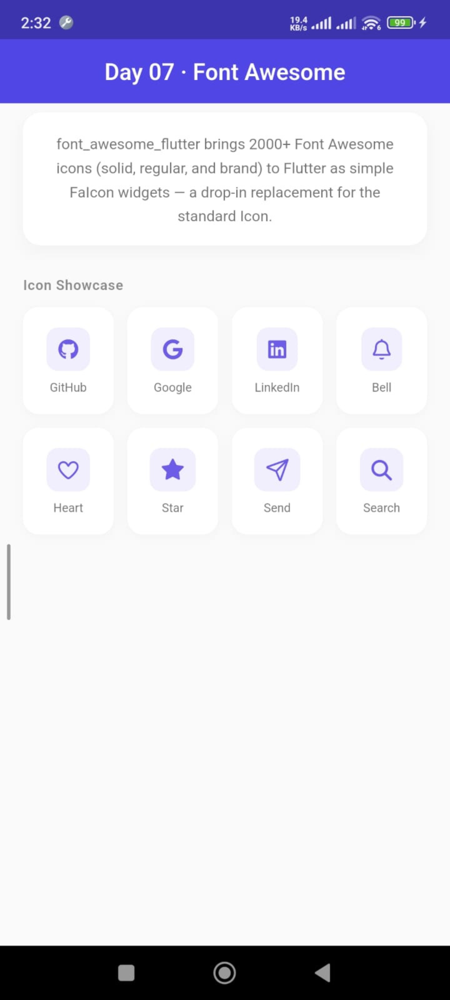
        </a>
      </td>
    </tr>
    <tr>
      <td align="center"><b>08</b></td>
      <td>
        <a href="lib/features/day08_animations/day08_animations.dart">
          <b>Animations</b>
        </a><br/>
        <sub>Morphing card transitions</sub>
      </td>
      <td>
        <a href="https://pub.dev/packages/animations">
          animations ^2.2.0
        </a>
      </td>
      <td align="center">
        <a href="screenshots/day08_animations.gif">
          
        </a>
      </td>
    </tr>
    <tr>
      <td align="center"><b>09</b></td>
      <td>
        <a href="lib/features/day09_neon/day09_neon.dart">
          <b>Neon</b>
        </a><br/>
        <sub>Glowing neon sign text</sub>
      </td>
      <td>
        <a href="https://pub.dev/packages/neon">
          neon ^0.1.0
        </a>
      </td>
      <td align="center">
        <a href="screenshots/day09_neon.png">
          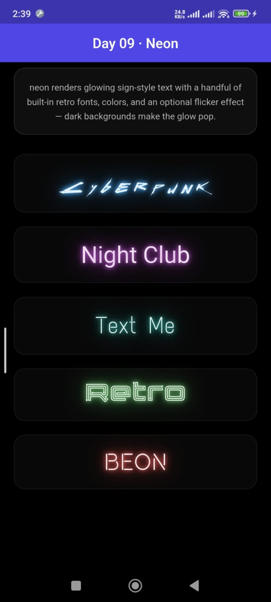
        </a>
      </td>
    </tr>
    <tr>
      <td align="center"><b>10</b></td>
      <td>
        <a href="lib/features/day10_aurora/day10_aurora.dart">
          <b>Aurora</b>
        </a><br/>
        <sub>Soft, blurred color blobs backdrop</sub>
      </td>
      <td>
        <a href="https://pub.dev/packages/aurora">
          aurora ^1.0.0
        </a>
      </td>
      <td align="center">
        <a href="screenshots/day10_aurora.gif">
          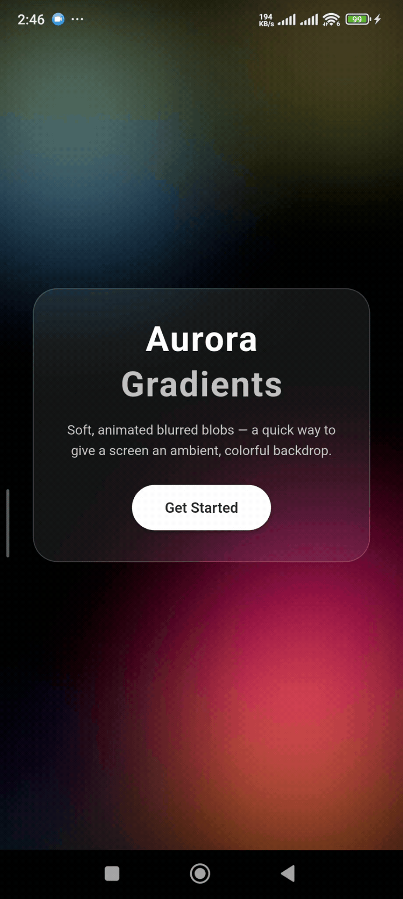
        </a>
      </td>
    </tr>
    <tr>
      <td align="center"><b>11</b></td>
      <td>
        <a href="lib/features/day11_card_swiper/day11_card_swiper.dart">
          <b>Card Swiper</b>
        </a><br/>
        <sub>Auto-playing swipeable carousel</sub>
      </td>
      <td>
        <a href="https://pub.dev/packages/card_swiper">
          card_swiper ^3.0.1
        </a>
      </td>
      <td align="center">
        <a href="screenshots/day11_card_swiper.gif">
          
        </a>
      </td>
    </tr>
    <tr>
      <td align="center"><b>12</b></td>
      <td>
        <a href="lib/features/day12_flutter_blurhash/day12_flutter_blurhash.dart">
          <b>BlurHash</b>
        </a><br/>
        <sub>Blurred image placeholders</sub>
      </td>
      <td>
        <a href="https://pub.dev/packages/flutter_blurhash">
          flutter_blurhash ^0.9.1
        </a>
      </td>
      <td align="center">
        <a href="screenshots/day12_flutter_blurhash.gif">
          
        </a>
      </td>
    </tr>
    <tr>
      <td align="center"><b>13</b></td>
      <td>
        <a href="lib/features/day13_flutter_svg/day13_flutter_svg.dart">
          <b>Flutter SVG</b>
        </a><br/>
        <sub>Scalable vector graphics (SVG)</sub>
      </td>
      <td>
        <a href="https://pub.dev/packages/flutter_svg">
          flutter_svg ^2.3.0
        </a>
      </td>
      <td align="center">
        <a href="screenshots/day13_flutter_svg.png">
          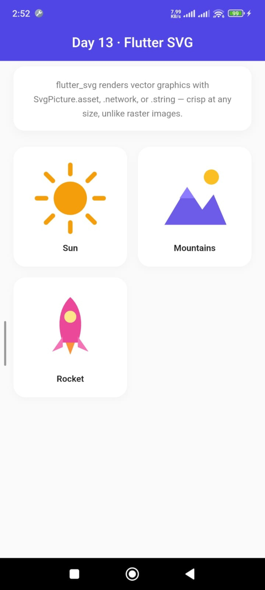
        </a>
      </td>
    </tr>
    <tr>
      <td align="center"><b>14</b></td>
      <td>
        <a href="lib/features/day14_flutter_custom_clippers/day14_flutter_custom_clippers.dart">
          <b>Custom Clippers</b>
        </a><br/>
        <sub>Pre-made ClipPath shapes</sub>
      </td>
      <td>
        <a href="https://pub.dev/packages/flutter_custom_clippers">
          flutter_custom_clippers ^2.1.0
        </a>
      </td>
      <td align="center">
        <a href="screenshots/day14_flutter_custom_clippers.gif">
          
        </a>
      </td>
    </tr>
    <tr>
      <td align="center"><b>15</b></td>
      <td>
        <a href="lib/features/day15_flutter_tts/day15_flutter_tts.dart">
          <b>Flutter TTS</b>
        </a><br/>
        <sub>Text-to-speech conversion</sub>
      </td>
      <td>
        <a href="https://pub.dev/packages/flutter_tts">
          flutter_tts ^4.2.5
        </a>
      </td>
      <td align="center">
        <a href="screenshots/day15_flutter_tts.gif">
          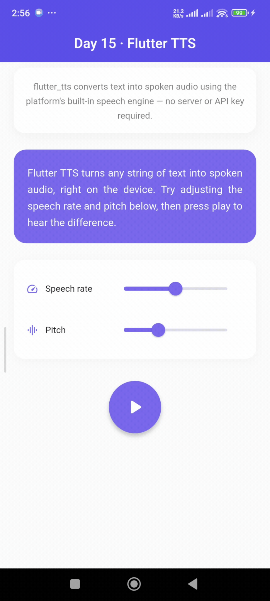
        </a>
      </td>
    </tr>
    <tr>
      <td align="center"><b>16</b></td>
      <td>
        <a href="lib/features/day16_flutter_highlight/day16_flutter_highlight.dart">
          <b>Flutter Highlight</b>
        </a><br/>
        <sub>Syntax-colored code blocks</sub>
      </td>
      <td>
        <a href="https://pub.dev/packages/flutter_highlight">
          flutter_highlight ^0.7.0
        </a>
      </td>
      <td align="center">
        <a href="screenshots/day16_flutter_highlight.gif">
          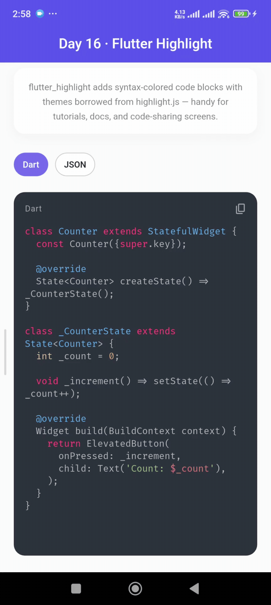
        </a>
      </td>
    </tr>
    <tr>
      <td align="center"><b>17</b></td>
      <td>
        <a href="lib/features/day17_syncfusion_flutter_charts/day17_syncfusion_flutter_charts.dart">
          <b>Syncfusion Charts</b>
        </a><br/>
        <sub>Production-ready charts</sub>
      </td>
      <td>
        <a href="https://pub.dev/packages/syncfusion_flutter_charts">
          syncfusion_flutter_charts ^34.1.32
        </a>
      </td>
      <td align="center">
        <a href="screenshots/day17_syncfusion_flutter_charts.gif">
          
        </a>
      </td>
    </tr>
    <tr>
      <td align="center"><b>18</b></td>
      <td>
        <a href="lib/features/day18_rflutter_alert/day18_rflutter_alert.dart">
          <b>RFlutter Alert</b>
        </a><br/>
        <sub>Styled alert dialogs</sub>
      </td>
      <td>
        <a href="https://pub.dev/packages/rflutter_alert">
          rflutter_alert ^2.0.7
        </a>
      </td>
      <td align="center">
        <a href="screenshots/day18_rflutter_alert.gif">
          
        </a>
      </td>
    </tr>
    <tr>
      <td align="center"><b>19</b></td>
      <td>
        <a href="lib/features/day19_flutter_settings_ui/day19_flutter_settings_ui.dart">
          <b>Settings UI</b>
        </a><br/>
        <sub>Native-feeling settings screens</sub>
      </td>
      <td>
        <a href="https://pub.dev/packages/flutter_settings_ui">
          flutter_settings_ui ^3.0.1
        </a>
      </td>
      <td align="center">
        <a href="screenshots/day19_flutter_settings_ui.gif">
          
        </a>
      </td>
    </tr>
    <tr>
      <td align="center"><b>20</b></td>
      <td>
        <a href="lib/features/day20_flutter_spinkit/day20_flutter_spinkit.dart">
          <b>Flutter Spinkit</b>
        </a><br/>
        <sub>20+ animated loading indicators</sub>
      </td>
      <td>
        <a href="https://pub.dev/packages/flutter_spinkit">
          flutter_spinkit ^5.2.2
        </a>
      </td>
      <td align="center">
        <a href="screenshots/day20_flutter_spinkit.gif">
          
        </a>
      </td>
    </tr>
    <tr>
      <td align="center"><b>21</b></td>
      <td>
        <a href="lib/features/day21_audioplayers/day21_audioplayers.dart">
          <b>Audioplayers</b>
        </a><br/>
        <sub>Play audio from assets, files, or URLs</sub>
      </td>
      <td>
        <a href="https://pub.dev/packages/audioplayers">
          audioplayers ^6.7.1
        </a>
      </td>
      <td align="center">
        <a href="screenshots/day21_audioplayers.gif">
          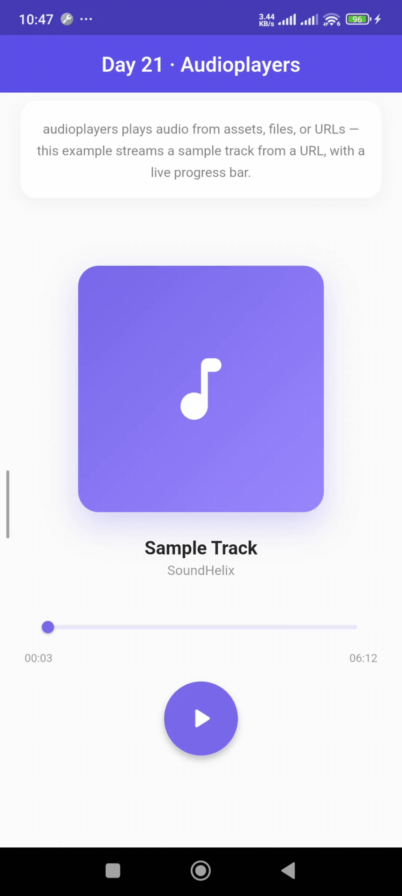
        </a>
      </td>
    </tr>
    <tr>
      <td align="center"><b>22</b></td>
      <td>
        <a href="lib/features/day22_go_router/day22_go_router.dart">
          <b>Go Router</b>
        </a><br/>
        <sub>Declarative, URL-based navigation</sub>
      </td>
      <td>
        <a href="https://pub.dev/packages/go_router">
          go_router ^17.3.0
        </a>
      </td>
      <td align="center">
        <a href="screenshots/day22_go_router.gif">
          
        </a>
      </td>
    </tr>
    <tr>
      <td align="center"><b>23</b></td>
      <td>
        <a href="lib/features/day23_http/day23_http.dart">
          <b>HTTP</b>
        </a><br/>
        <sub>Making HTTP requests</sub>
      </td>
      <td>
        <a href="https://pub.dev/packages/http">
          http ^1.6.0
        </a>
      </td>
      <td align="center">
        <a href="screenshots/day23_http.gif">
          
        </a>
      </td>
    </tr>
    <tr>
      <td align="center"><b>24</b></td>
      <td>
        <a href="lib/features/day24_onboarding/day24_onboarding.dart">
          <b>Onboarding</b>
        </a><br/>
        <sub>Drag-based onboarding flow</sub>
      </td>
      <td>
        <a href="https://pub.dev/packages/onboarding">
          onboarding ^4.0.2
        </a>
      </td>
      <td align="center">
        <a href="screenshots/day24_onboarding.gif">
          
        </a>
      </td>
    </tr>
    <tr>
      <td align="center"><b>25</b></td>
      <td>
        <a href="lib/features/day25_flutter_neumorphic_plus/day25_flutter_neumorphic_plus.dart">
          <b>Flutter Neumorphic</b>
        </a><br/>
        <sub>Soft neumorphic UI components</sub>
      </td>
      <td>
        <a href="https://pub.dev/packages/flutter_neumorphic_plus">
          flutter_neumorphic_plus ^3.5.0
        </a>
      </td>
      <td align="center">
        <a href="screenshots/day25_flutter_neumorphic_plus.gif">
          
        </a>
      </td>
    </tr>
    <tr>
      <td align="center"><b>26</b></td>
      <td>
        <a href="lib/features/day26_math_expressions/day26_math_expressions.dart">
          <b>Math Expressions</b>
        </a><br/>
        <sub>Parse and evaluate math expressions</sub>
      </td>
      <td>
        <a href="https://pub.dev/packages/math_expressions">
          math_expressions ^3.1.0
        </a>
      </td>
      <td align="center">
        <a href="screenshots/day26_math_expressions.gif">
          
        </a>
      </td>
    </tr>
    <tr>
      <td align="center"><b>27</b></td>
      <td>
        <a href="lib/features/day27_clay_containers/day27_clay_containers.dart">
          <b>Clay Containers</b>
        </a><br/>
        <sub>Moldable "clay" containers</sub>
      </td>
      <td>
        <a href="https://pub.dev/packages/clay_containers">
          clay_containers ^0.3.4
        </a>
      </td>
      <td align="center">
        <a href="screenshots/day27_clay_containers.png">
          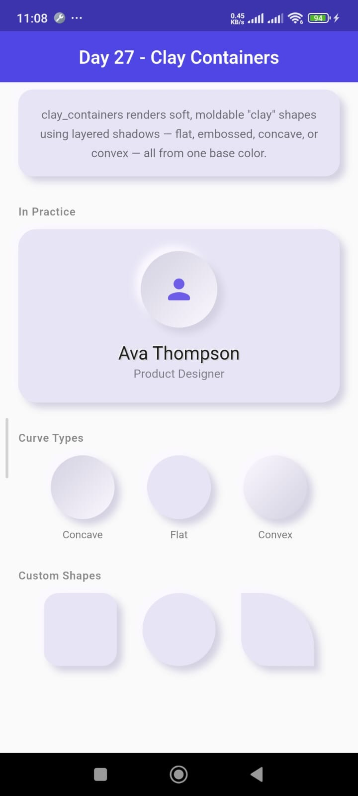
        </a>
      </td>
    </tr>
    <tr>
      <td align="center"><b>28</b></td>
      <td>
        <a href="lib/features/day28_day_night_switch/day28_day_night_switch.dart">
          <b>Day/Night Switch</b>
        </a><br/>
        <sub>Animated day/night theme switch</sub>
      </td>
      <td>
        <a href="https://pub.dev/packages/day_night_switch">
          day_night_switch ^1.0.4
        </a>
      </td>
      <td align="center">
        <a href="screenshots/day28_day_night_switch.gif">
          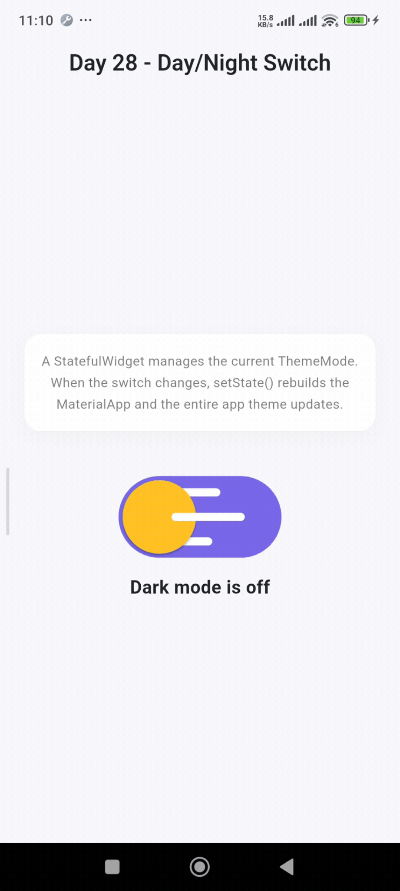
        </a>
      </td>
    </tr>
    <tr>
      <td align="center"><b>29</b></td>
      <td>
        <a href="lib/features/day29_provider/day29_provider.dart">
          <b>Provider</b>
        </a><br/>
        <sub>Simple state management</sub>
      </td>
      <td>
        <a href="https://pub.dev/packages/provider">
          provider ^6.1.5+1
        </a>
      </td>
      <td align="center">
        <a href="screenshots/day29_provider.gif">
          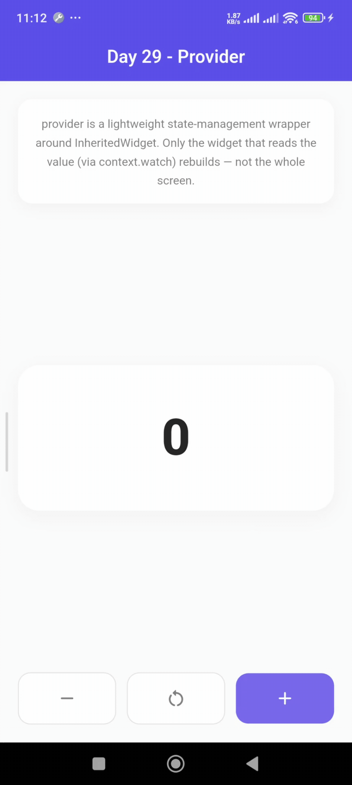
        </a>
      </td>
    </tr>
    <tr>
      <td align="center"><b>30</b></td>
      <td>
        <a href="lib/features/day30_flutter_lucide/day30_flutter_lucide.dart">
          <b>Flutter Lucide</b>
        </a><br/>
        <sub>1,699+ simple outline icons</sub>
      </td>
      <td>
        <a href="https://pub.dev/packages/flutter_lucide">
          flutter_lucide ^1.11.0
        </a>
      </td>
      <td align="center">
        <a href="screenshots/day30_flutter_lucide.png">
          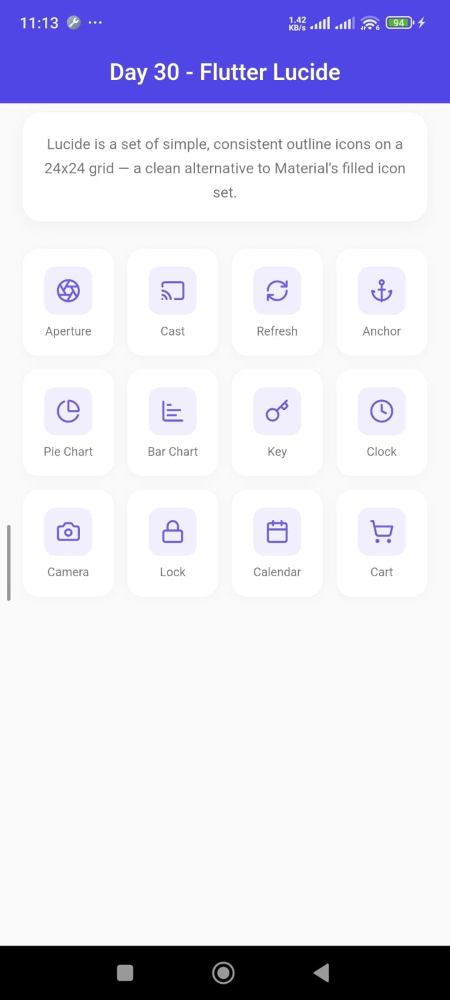
        </a>
      </td>
    </tr>
    <tr>
      <td align="center"><b>31</b></td>
      <td>
        <a href="lib/features/day31_simple_gradient_text/day31_simple_gradient_text.dart">
          <b>Gradient Text</b>
        </a><br/>
        <sub>Gradient-painted text</sub>
      </td>
      <td>
        <a href="https://pub.dev/packages/simple_gradient_text">
          simple_gradient_text ^1.4.0
        </a>
      </td>
      <td align="center">
        <a href="screenshots/day31_simple_gradient_text.png">
          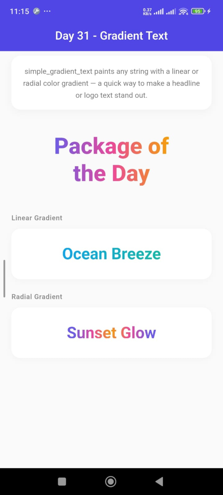
        </a>
      </td>
    </tr>
    <tr>
      <td align="center"><b>32</b></td>
      <td>
        <a href="lib/features/day32_image_picker/day32_image_picker.dart">
          <b>Image Picker</b>
        </a><br/>
        <sub>Pick images from gallery or camera</sub>
      </td>
      <td>
        <a href="https://pub.dev/packages/image_picker">
          image_picker ^1.2.3
        </a>
      </td>
      <td align="center">
        <a href="screenshots/day32_image_picker.gif">
          
        </a>
      </td>
    </tr>
    <tr>
      <td align="center"><b>33</b></td>
      <td>
        <a href="lib/features/day33_curved_labeled_navigation_bar/day33_curved_labeled_navigation_bar.dart">
          <b>Curved Nav Bar</b>
        </a><br/>
        <sub>Animated curved bottom nav bar</sub>
      </td>
      <td>
        <a href="https://pub.dev/packages/curved_labeled_navigation_bar">
          curved_labeled_navigation_bar ^2.0.6
        </a>
      </td>
      <td align="center">
        <a href="screenshots/day33_curved_labeled_navigation_bar.gif">
          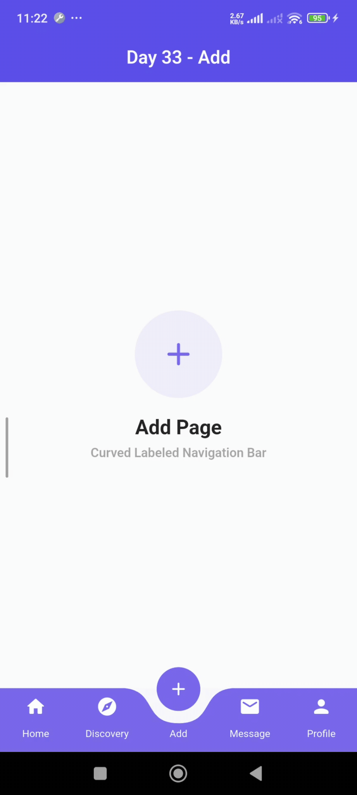
        </a>
      </td>
    </tr>
    <tr>
      <td align="center"><b>34</b></td>
      <td>
        <a href="lib/features/day34_intro_slider/day34_intro_slider.dart">
          <b>Intro Slider</b>
        </a><br/>
        <sub>Full-screen onboarding slider</sub>
      </td>
      <td>
        <a href="https://pub.dev/packages/intro_slider">
          intro_slider ^4.2.5
        </a>
      </td>
      <td align="center">
        <a href="screenshots/day34_intro_slider.gif">
          
        </a>
      </td>
    </tr>
    <tr>
      <td align="center"><b>35</b></td>
      <td>
        <a href="lib/features/day35_phosphor_flutter_icons/day35_phosphor_flutter_icons.dart">
          <b>Phosphor Icons</b>
        </a><br/>
        <sub>Flexible icon family with 6 styles</sub>
      </td>
      <td>
        <a href="https://pub.dev/packages/phosphor_flutter">
          phosphor_flutter ^2.1.0
        </a>
      </td>
      <td align="center">
        <a href="screenshots/day35_phosphor_flutter_icons.png">
          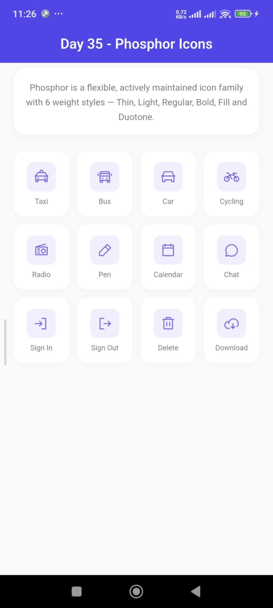
        </a>
      </td>
    </tr>
    <tr>
      <td align="center"><b>36</b></td>
      <td>
        <a href="lib/features/day36_flutter_staggered_grid_view/day36_flutter_staggered_grid_view.dart">
          <b>Staggered Grid</b>
        </a><br/>
        <sub>Advanced grid layout delegates</sub>
      </td>
      <td>
        <a href="https://pub.dev/packages/flutter_staggered_grid_view">
          flutter_staggered_grid_view ^0.7.0
        </a>
      </td>
      <td align="center">
        <a href="screenshots/day36_flutter_staggered_grid_view.gif">
          
        </a>
      </td>
    </tr>
    <tr>
      <td align="center"><b>37</b></td>
      <td>
        <a href="lib/features/day37_shimmer/day37_shimmer.dart">
          <b>Shimmer</b>
        </a><br/>
        <sub>Animated shimmer loading effect</sub>
      </td>
      <td>
        <a href="https://pub.dev/packages/shimmer">
          shimmer ^3.0.0
        </a>
      </td>
      <td align="center">
        <a href="screenshots/day37_shimmer.gif">
          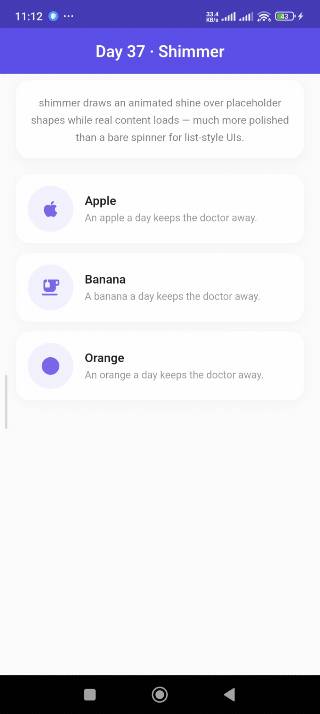
        </a>
      </td>
    </tr>
    <tr>
      <td align="center"><b>38</b></td>
      <td>
        <a href="lib/features/day38_lottie/day38_lottie.dart">
          <b>Lottie</b>
        </a><br/>
        <sub>After Effects Lottie animations</sub>
      </td>
      <td>
        <a href="https://pub.dev/packages/lottie">
          lottie ^3.3.3
        </a>
      </td>
      <td align="center">
        <a href="screenshots/day38_lottie.gif">
          
        </a>
      </td>
    </tr>
    <tr>
      <td align="center"><b>39</b></td>
      <td>
        <a href="lib/features/day39_shared_preferences/day39_shared_preferences.dart">
          <b>Shared Preferences</b>
        </a><br/>
        <sub>Persistent local storage</sub>
      </td>
      <td>
        <a href="https://pub.dev/packages/shared_preferences">
          shared_preferences ^2.5.5
        </a>
      </td>
      <td align="center">
        <a href="screenshots/day39_shared_preferences.gif">
          
        </a>
      </td>
    </tr>
    <tr>
      <td align="center"><b>40</b></td>
      <td>
        <a href="lib/features/day40_auto_size_text_plus/day40_auto_size_text_plus.dart">
          <b>Auto Size Text</b>
        </a><br/>
        <sub>Automatically resizing text</sub>
      </td>
      <td>
        <a href="https://pub.dev/packages/auto_size_text_plus">
          auto_size_text_plus ^3.0.2
        </a>
      </td>
      <td align="center">
        <a href="screenshots/day40_auto_size_text_plus.gif">
          
        </a>
      </td>
    </tr>
    <tr>
      <td align="center"><b>41</b></td>
      <td>
        <a href="lib/features/day41_device_info_plus/day41_device_info_plus.dart">
          <b>Device Info Plus</b>
        </a><br/>
        <sub>Read device details</sub>
      </td>
      <td>
        <a href="https://pub.dev/packages/device_info_plus">
          device_info_plus ^13.2.0
        </a>
      </td>
      <td align="center">
        <a href="screenshots/day41_device_info_plus.png">
          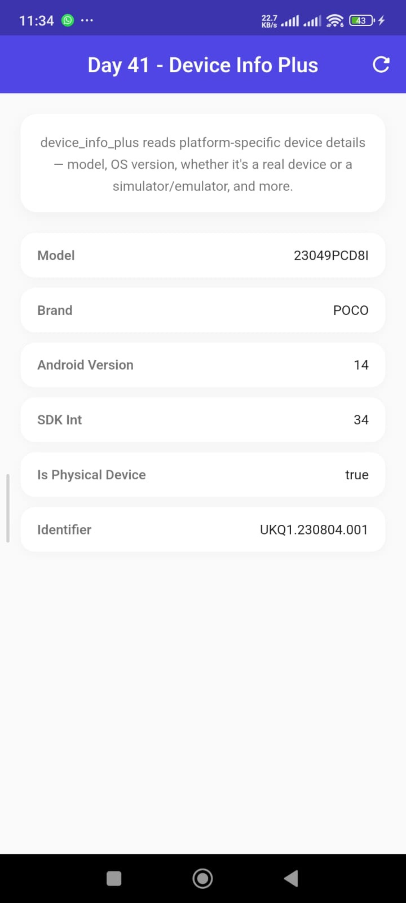
        </a>
      </td>
    </tr>
    <tr>
      <td align="center"><b>42</b></td>
      <td>
        <a href="lib/features/day42_geolocator/day42_geolocator.dart">
          <b>Geolocator</b>
        </a><br/>
        <sub>Read device GPS coordinates</sub>
      </td>
      <td>
        <a href="https://pub.dev/packages/geolocator">
          geolocator ^14.0.3
        </a>
      </td>
      <td align="center">
        <a href="screenshots/day42_geolocator.gif">
          
        </a>
      </td>
    </tr>
    <tr>
      <td align="center"><b>43</b></td>
      <td>
        <a href="lib/features/day43_glass_kit/day43_glass_kit.dart">
          <b>Glass Kit</b>
        </a><br/>
        <sub>Frosted glass glassmorphism UI</sub>
      </td>
      <td>
        <a href="https://pub.dev/packages/glass_kit">
          glass_kit ^4.0.2
        </a>
      </td>
      <td align="center">
        <a href="screenshots/day43_glass_kit.png">
          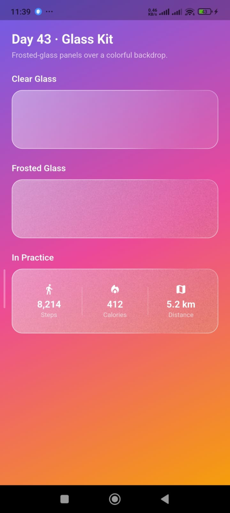
        </a>
      </td>
    </tr>
    <tr>
      <td align="center"><b>44</b></td>
      <td>
        <a href="lib/features/day44_url_launcher/day44_url_launcher.dart">
          <b>URL Launcher</b>
        </a><br/>
        <sub>Open links, dialers, SMS, and email</sub>
      </td>
      <td>
        <a href="https://pub.dev/packages/url_launcher">
          url_launcher ^6.3.2
        </a>
      </td>
      <td align="center">
        <a href="screenshots/day44_url_launcher.gif">
          
        </a>
      </td>
    </tr>
    <tr>
      <td align="center"><b>45</b></td>
      <td>
        <a href="lib/features/day45_webview_flutter/day45_webview_flutter.dart">
          <b>WebView Flutter</b>
        </a><br/>
        <sub>Embed interactive web pages</sub>
      </td>
      <td>
        <a href="https://pub.dev/packages/webview_flutter">
          webview_flutter ^4.14.1
        </a>
      </td>
      <td align="center">
        <a href="screenshots/day45_webview_flutter.gif">
          
        </a>
      </td>
    </tr>
    <tr>
      <td align="center"><b>46</b></td>
      <td>
        <a href="lib/features/day46_sizer/day46_sizer.dart">
          <b>Sizer</b>
        </a><br/>
        <sub>Responsive percentage-based sizing</sub>
      </td>
      <td>
        <a href="https://pub.dev/packages/sizer">
          sizer ^3.1.3
        </a>
      </td>
      <td align="center">
        <a href="screenshots/day46_sizer.gif">
          
        </a>
      </td>
    </tr>
    <tr>
      <td align="center"><b>47</b></td>
      <td>
        <a href="lib/features/day47_video_player/day47_video_player.dart">
          <b>Video Player</b>
        </a><br/>
        <sub>Play videos from network or assets</sub>
      </td>
      <td>
        <a href="https://pub.dev/packages/video_player">
          video_player ^2.11.1
        </a>
      </td>
      <td align="center">
        <a href="screenshots/day47_video_player.gif">
          
        </a>
      </td>
    </tr>
    <tr>
      <td align="center"><b>48</b></td>
      <td>
        <a href="lib/features/day48_responsive_framework/day48_responsive_framework.dart">
          <b>Responsive Framework</b>
        </a><br/>
        <sub>Adaptive layouts for all screens</sub>
      </td>
      <td>
        <a href="https://pub.dev/packages/responsive_framework">
          responsive_framework ^1.5.1
        </a>
      </td>
      <td align="center">
        <a href="screenshots/day48_responsive_framework.gif">
          
        </a>
      </td>
    </tr>
    <tr>
      <td align="center"><b>49</b></td>
      <td>
        <a href="lib/features/day49_timelines_upgraded/day49_timelines_upgraded.dart">
          <b>Timelines Upgraded</b>
        </a><br/>
        <sub>Vertical timeline of steps</sub>
      </td>
      <td>
        <a href="https://pub.dev/packages/timelines_upgraded">
          timelines_upgraded ^0.1.1
        </a>
      </td>
      <td align="center">
        <a href="screenshots/day49_timelines_upgraded.png">
          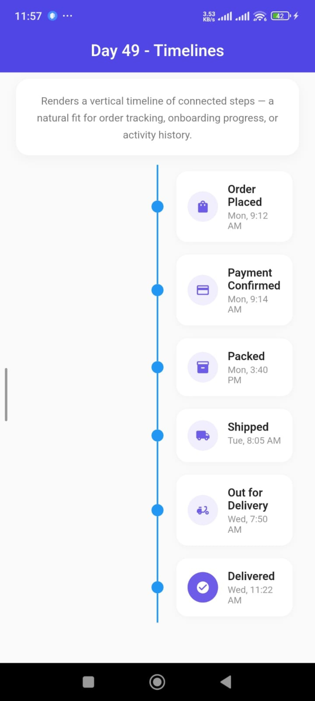
        </a>
      </td>
    </tr>
    <tr>
      <td align="center"><b>50</b></td>
      <td>
        <a href="lib/features/day50_just_audio/day50_just_audio.dart">
          <b>Just Audio</b>
        </a><br/>
        <sub>Stream and play audio from a URL</sub>
      </td>
      <td>
        <a href="https://pub.dev/packages/just_audio">
          just_audio ^0.10.6
        </a>
      </td>
      <td align="center">
        <a href="screenshots/day50_just_audio.gif">
          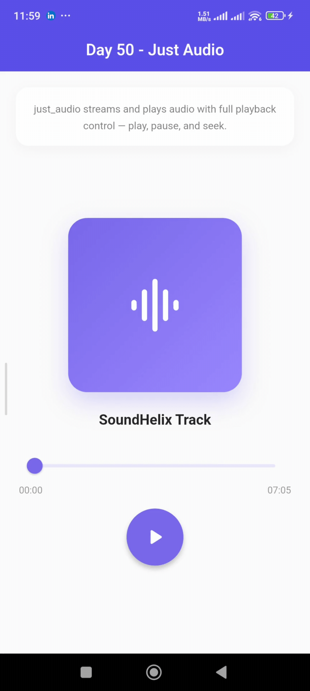
        </a>
      </td>
    </tr>
  </tbody>
</table>

---

## 🚀 Goal

To explore the Flutter ecosystem by learning one package at a time, understanding its purpose, API, best practices, and real-world implementation through practical examples.

---

## 🛠️ Tech Stack

- Flutter
- Dart
- Pub.dev Packages

---

## 🚀 Getting Started

```bash
# Clone the repository
git clone https://github.com/SheikhAman/package_of_the_day.git

# Navigate to the project
cd package_of_the_day

# Install dependencies
flutter pub get

# Run the application
flutter run
```

---

## 📌 Note

This repository is created for learning and practice purposes.  
Each package is implemented in its own example to keep the code clean, focused, and easy to understand.

---

## ⭐ Future Improvements

- Cover 100+ popular Flutter packages
- Add package comparisons and alternatives
- Build mini real-world apps using multiple packages
- Add web support where applicable
- Keep examples updated with the latest package versions